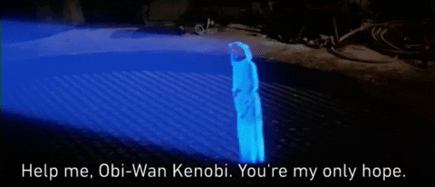
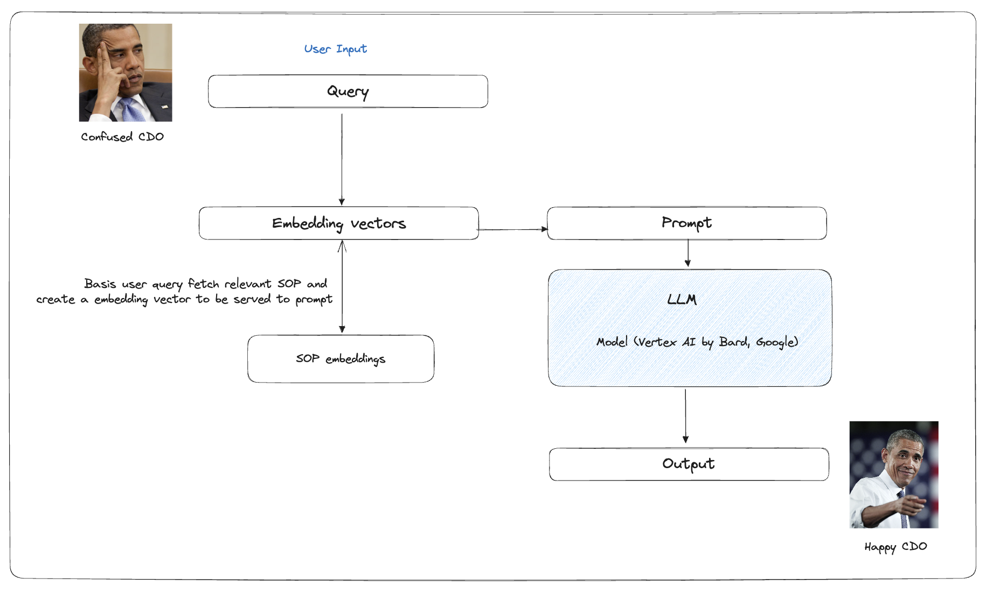

## Problem statement:

- To reduce information asymmetry and knowledge gaps for discovering business use cases and offer creation states
- To improve efficiency of on call queries and # of tickets/month-thus saving bad burn too
### Impact:
- 23 Cr. CM/Bottomline Savings per year
- 160+ dev hours saved per month

Solution:
OBI-WAN- Offer Business Interactions- Wise Answering Network (For all the Star Wars fans out there :D)

- It is a chatgpt like text based (not conversation like for now) interface that can help answering all business queries start from offer creation -> go live states -> maintenance states 
- The intent is to resolve CDO questions starting from which format to use for their use case, how to create a certain offer, what does it mean for a particular state in their offer
- Primarily this will help in better knowledge assimilation and reduction of information gaps in promotions workflows. Hence, helping CDO teams to better understand any offer, the dimensions of it and have much smoother flows in general. 
- Problem might seem small to internal promotions users where we are well equipped to answer for all contexts but for a CDO category manager or ops person trying to create an offer and seeing any new field can be overwhelming a lot of times ! 

## Approach:

Using the same approach, other platform knowledge gaps and information symmetry issues can be handled. 

## Demo

<video width="720" height="360" controls>
  <source src="./readme/demo.mp4" type="video/mp4">
  Your browser does not support the video tag.
</video>

## LLD